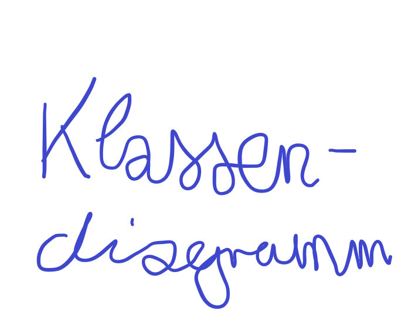

# Caelio

Anwendung zur Überwachung von Luft-Messwerten.

## Inhalt

* [Beschreibung](#beschreibung)
* [Bedienung](#bedienung)
* [Implementierung](#implementierung)

## Beschreibung

Die Anwendung stellt eine grafische Oberfläche zur Überwachung von Luft-Messwerten von [SenseBoxen](https://sensebox.de/), welche auf der [OpenSenseMap](https://opensensemap.org/) zu finden sind, bereit.

## Bedienung

Die Anwendung ist als JavaFX Application über die Klasse `Anwendung` im BlueJ-Projekt unter `Anwendung/package.bluej` zu starten.

## Implementierung

Klassendiagramm:

