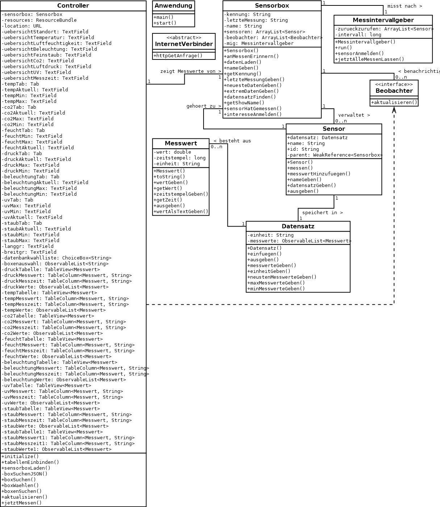

# Caelio

Anwendung zur Überwachung von Luft-Messwerten.

## Inhalt

* [Beschreibung](#beschreibung)
* [Bedienung](#bedienung)
* [Implementierung](#implementierung)

## Beschreibung

Die Anwendung stellt eine grafische Oberfläche zur Überwachung von Luft-Messwerten von [SenseBoxen](https://sensebox.de/), welche auf der [OpenSenseMap](https://opensensemap.org/) zu finden sind, bereit.

Caelio ist ein Programm, welches Messdaten einer Wetterstation anschaulich ausgeben kann. Hierbei werden aktuell die Daten einer sogenannten SenseBox, die derzeit am Ignaz-Taschner-Gymnasium in Dachau ihren Standpunkt hat, verwendet. Folgende Daten können eingesehen werden: Temperatur, Luftfeuchtigkeit, Luftdruck, Beleuchtungsstärke, UV-Intensität und Feinstaub.
Diese Daten werden bei Internetverbindung ungefähr minütlich aktualisiert.

Verwendete Einheiten:

Temperatur: C°

Luftfeuchtigkeit: %

Luftdruck: 1 hPa = 100 Pa (Pascal) = 100 Newton / Quadratmeter (Mittlerer Luftdruck der Erdatmosphäre auf Meereshöhe: 1013,25 hPa)

Beleuchtungsstärke: lx (Lux) (Wert der Beleuchtungsstärke bei einem wolkenfreien Sommertag ca.: 100.000 lx)

UV-Intensität: μW/cm² (Mikrowatt / Quadratzentimeter) (unbedenkliche UV-Intensität bei einem Wert von ca.: 5.62μW/cm²)

Feinstaub: µg/m³ (PM10) (Mikrogramm / Kubikmeter; PM10 ≙ Partikel mit aerodynamischem Durchmesser von weniger als 10 Mikrometer) (unbedenklicher Wert: 0.5µg/m³(PM10))

## Bedienung

Die Anwendung ist als JavaFX Application über die Klasse `Anwendung` im BlueJ-Projekt unter `Anwendung/package.bluej` zu starten.

## Implementierung

Klassendiagramm:

